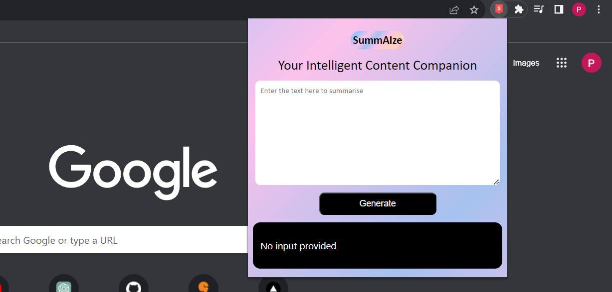
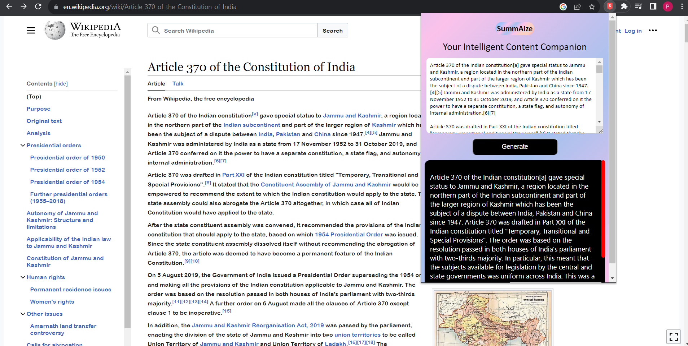

# SummAIze - Your Intelligent Content Companion 📚

SummAIze is a Chrome extension that brings the power of AI-driven text summarization to your fingertips. Easily summarize text from articles, documents, and more, making information consumption faster and more efficient.

## Usage

Follow these simple steps to get started with SummAIze:

1. **Download and Extract**: Download the repository as a zip file and extract it to a folder on your computer.

2. **Enable Developer Mode**: Open Google Chrome and go to `chrome://extensions/`. Toggle on the "Developer mode" switch located on the top right corner.

3. **Load the Extension**: Click on the "Load unpacked" button and select the folder where you extracted the extension files.

4. **Get Your API Key**: Sign up for a free account on Rapid API and obtain your API key.

5. **Configure API Key**: Open the `popup.js` file in the `js` folder. Locate the `const API_KEY = "YOUR_API_KEY";` line and replace `"YOUR_API_KEY"` with your actual Rapid API key.

6. **Summarize with Ease**: Whenever you come across a lengthy piece of text, click on the SummAIze extension icon in your Chrome browser to generate a concise summary.

## Features

- 🚀 Quickly summarize text within your browser.
- 🧠 Powered by advanced AI algorithms.
- 🌐 Accessible across different websites and platforms.
- ⚙️ Simple setup and easy-to-use interface.
- 🆓 Free to use! Get your own Rapid API key and start summarizing.

## Screenshots

## Contributing

We welcome contributions from the community! If you have any ideas, bug reports, or feature requests, please feel free to [open an issue](link_to_issue_tracker) or submit a pull request.

## License

This project is licensed under the [MIT License](/LICENSE).
